<h3><code>vitin@github ~ $ ./contributions.sh</code></h3>

  

<h3><code>vitin@github ~ $ whoami</code></h3>

<table>
<tr>
<td valign="top"></td>
<td valign="top"></td>
</tr>
</table>

 

<h3><code>vitin@github ~ $ ./about.sh</code></h3>

<b>Vitor Luan · IA · Desenvolvimento · Automação</b>

Aprendendo na prática e transformando ideias em projetos.

<a href="https://github.com/vitorluancordeiro22-dot?tab=repositories">Meus repositórios</a>

